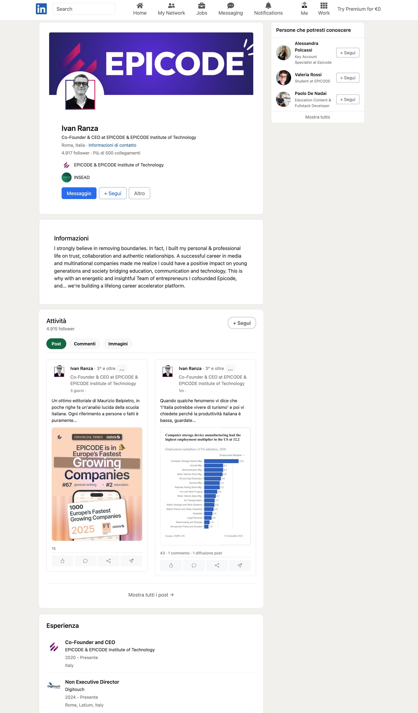

<h1 align="center">
    
</h1>

Un clone fedele dell'interfaccia di LinkedIn che permette di visualizzare profili, esperienze lavorative e attività utilizzando le API di Strive School.

**👉 [Visualizza la versione live del progetto](https://5-1-build-week-ch-1.vercel.app/)**


## 📋 Descrizione

Questo progetto è un clone di LinkedIn che replica l'esperienza utente della piattaforma originale. Sviluppato con React e tecnologie web moderne, offre un'interfaccia reattiva e professionale che funziona su tutti i dispositivi.

## 🚀 Tecnologie Utilizzate

- **React**: Libreria JavaScript per la costruzione dell'interfaccia utente
- **Vite**: Build tool per un'esperienza di sviluppo moderna
- **Bootstrap 5**: Framework CSS per un design responsive
- **React Bootstrap**: Componenti Bootstrap per React
- **React Icons**: Libreria di icone per l'interfaccia
- **Fetch API**: Per le chiamate asincrone alle API
- **CSS3**: Stili personalizzati e animazioni
- **Environment Variables**: Gestione sicura delle configurazioni

## ⚙️ Caratteristiche

- Visualizzazione del profilo utente con foto e informazioni personali
- Sezione esperienze lavorative con timeline interattiva
- Componente attività per la visualizzazione dei post
- Barra di ricerca per trovare altri profili
- Layout responsive ottimizzato per desktop e mobile
- Navbar con funzionalità di ricerca e notifiche
- Sidebar con informazioni aggiuntive e collegamenti rapidi

## 🛠️ Installazione

```bash
# Clona il repository
git clone https://github.com/tuousername/linkedin-clone.git

# Naviga nella directory del progetto
cd linkedin-clone

# Installa le dipendenze
npm install

# Crea il file .env basandoti su .env.example
cp .env.example .env

# Avvia il server di sviluppo
npm run dev
```
## 📸 Screenshot



## 🖥️ Struttura del Progetto

```
linkedin-clone/
├── src/
│   ├── components/     # Componenti React
│   │   ├── css/       # Stili dei componenti
│   │   ├── Mynav.jsx  # Navbar principale
│   │   ├── HeroComponent.jsx # Sezione profilo
│   │   └── ...
│   ├── App.jsx        # Componente principale
│   └── main.jsx       # Entry point
├── public/            # Asset statici
└── package.json       # Dipendenze e script
```
## 🤝 Contributi

Le contribuzioni sono sempre benvenute! Apri una **issue** o invia un **pull request** per suggerire modifiche.

### 👤 Contributori

- [henry8913](https://github.com/henry8913)
- [Miriamcarroccetto](https://github.com/Miriamcarroccetto)
- [Islam95-ellaket](https://github.com/Islam95-ellaket)
- [Marco-Romano8](https://github.com/Marco-Romano8)

## 👤 Autori

Progetto demo creato da [Team 1](https://5-1-build-week-ch-1.vercel.app/) per scopi didattici.

## 📝 Licenza

Questo progetto è distribuito sotto licenza MIT. Vedi il file `LICENSE.txt` per ulteriori dettagli.
